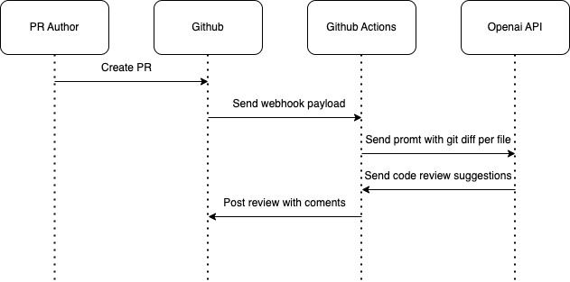
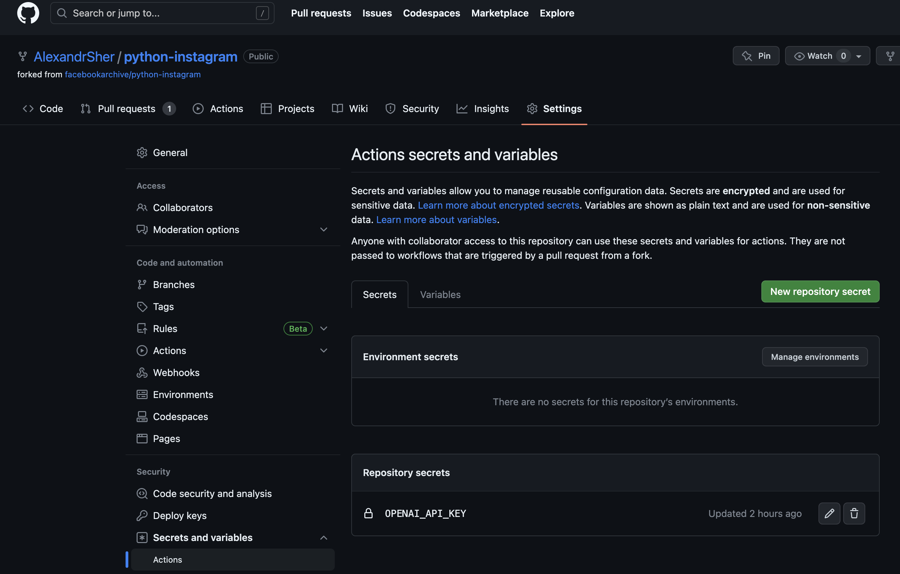

# schema



# Integrations steps

- get Openai API key for your organization [API keys](https://platform.openai.com/account/api-keys)
- set OPENAI_API_KEY secret in your Github repo like ```https://github.com/user/project/settings/secrets/actions```

- create .github/workflows/chatgpt-review.yaml file and put inside:
```
name: Code Review

permissions:
  contents: read
  pull-requests: write

on:
  pull_request:
    types: [opened, reopened, synchronize]

jobs:
  test:
    # if: ${{ contains(github.event.*.labels.*.name, 'gpt review') }} # Optional; to run only when a label is attached
    runs-on: ubuntu-latest
    steps:
      - uses: anc95/ChatGPT-CodeReview@main
        env:
          GITHUB_TOKEN: ${{ secrets.GITHUB_TOKEN }}
          OPENAI_API_KEY: ${{ secrets.OPENAI_API_KEY }}
          # Optional
          LANGUAGE: English
          OPENAI_API_ENDPOINT: https://api.openai.com/v1
          MODEL:
          top_p: 1
          temperature: 1
```
[source](https://github.com/marketplace/actions/chatgpt-codereviewer)
- push our changes in new branch and open PR to test

**Warning**
Be aware that you should enable billing in your openai account and set Usage limits